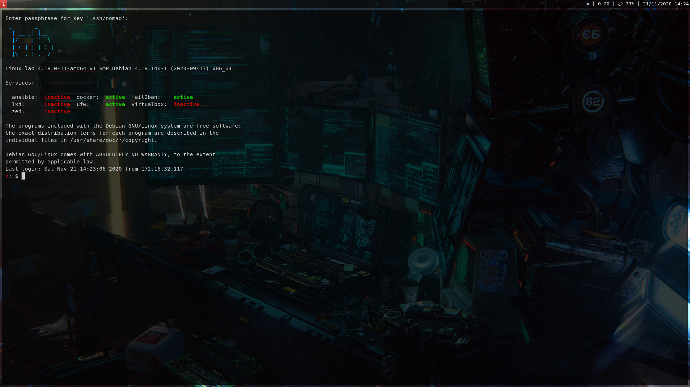

# debian-server

[](https://github.com/charlesrocket/debian-server/actions)

Ansible playbook for **Debian** server

### Start

```bash
#from /home/$USER
curl https://raw.githubusercontent.com/charlesrocket/debian-server/main/bootstrap | bash
```

_Edit `group_vars/all.yml` before starting the playbook!_
