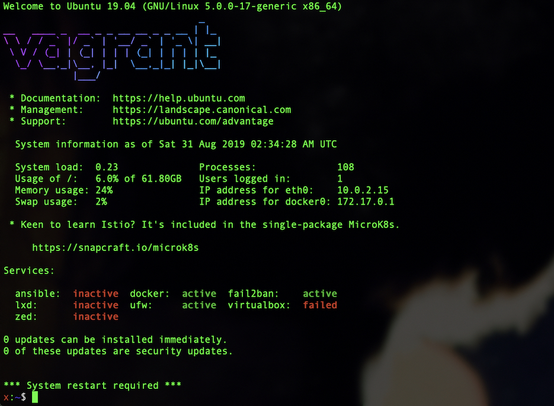

# disco-playbook

[](https://travis-ci.com/charlesrocket/disco-playbook)
[](https://galaxy.ansible.com/charlesrocket/disco_playbook)

Ansible playbook for **Ubuntu 19.04** server

### Start

```
git clone https://https://github.com/charlesrocket/disco-playbook
cd disco-playbook
./install.sh
```

_Edit `group_vars/all.yml` before starting the playbook!_
